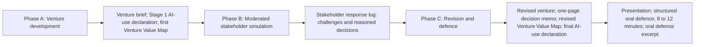

# Project architecture

## Purpose and evidence boundary

The HeXie-AI Venture Challenge addresses the assessment problem identified in the project's funding application: AI-assisted venture outputs may look accomplished while revealing little about the judgement behind them. The design makes opportunity framing, evidence selection, stakeholder decisions and revision visible over time. Its two core innovations are the capability rubric and the moderated stakeholder simulation. The Venture Value Lens extends their treatment of commercial and social value. These are design propositions whose educational effects require live evaluation.

The first live run is scheduled for early December 2026, date to be confirmed. It is voluntary and separate from module assessment. This release combines design resources, a prototype and internal SYNTHETIC validation. No student learning gains, participant satisfaction or human judge reliability can yet be claimed. This distinction governs all five layers below.

## Layer 1: AI-era assessment design

The unit of evidence is the team's reasoned movement from an initial venture to a defended recommendation. Phase A permits AI-assisted ideation, analysis and drafting, with a declaration of what AI produced and what humans verified, changed or rejected. Phase B introduces stakeholder challenges. Phase C requires an explicit feasibility judgement and live explanation. Each phase preserves evidence needed to interpret the next.

The intended mechanism is straightforward: retain initial assumptions; expose them to conflicting priorities; record decisions; compare the revised proposal with the baseline; question the reasons. A plausible final document alone cannot show this sequence. Declarations make tool use inspectable, while the memo and oral defence provide opportunities to probe understanding. None independently guarantees valid assessment. The playbook therefore uses them together without adding a separate score for AI fluency.

## Layer 2: Capability rubric

The [canonical rubric](../02_assessment_kit/capability_rubric.md) assesses Opportunity Recognition (25%), Feasibility Judgement (25%), Stakeholder Reasoning (20%), Ethical Positioning (15%) and Venture Communication (15%). Its four levels are Advanced, Proficient, Developing and Emerging. The weights are defaults that module leaders may adapt. They are cluster weights, not separate percentages for phases or documents.

Assessors connect each judgement to specific evidence: an assumption in the brief, a response-log decision, a mechanism in the value map or an oral answer. Strong work may justify proceeding, pivoting, pausing or stopping. The direction of the decision earns no automatic advantage. Judges consider evidence, alternatives, uncertainty and the team's ability to defend its position. Calibration is designed to limit halo effects from charisma, prose, visual design and familiarity with a particular discipline.

## Layer 3: Moderated stakeholder simulation

The project's approved name, Stakeholder-Agent Swarm Simulation, denotes a moderated panel in this release. During development, the design moved from a free-running multi-agent concept to bounded personas, evidence rules, human oversight and structured outputs. The design addresses variability and unsupported assertions by making feedback reviewable before students use it.

The five roles are Investor, Customer, Supplier / Operations Partner, Regulator and Community / Ethics Stakeholder. Lender / green-finance and enterprise-buyer variants adjust the first two roles where appropriate. All roles share the same venture facts; disagreement concerns priorities, risk tolerance, time horizons and claims. The moderator checks role consistency, evidence and tone. The facilitator controls release, correction and interruption. The Regulator uses non-authoritative language and gives no legal advice.

Teams classify feedback as `ADOPT`, `PARTIALLY ADOPT`, `REJECT` or `DEFER`, giving a reason and the evidence that would change the decision. This creates a record of judgement under competing demands. The [simulation kit](../03_simulation_kit/simulation_design.md) contains the delivery detail. Its prototype includes an offline deterministic mode; its LLM mode is a provider-agnostic stub, so live model integration must be verified separately.

## Layer 4: Venture Value Lens

The [Venture Value Lens](../04_venture_value_lens/value_lens_method.md) asks teams to map the venture to an industry, select 3 to 5 material topics and assess exposure and management readiness. High exposure requires readiness of at least 2, a designed mechanism with ownership and costs. Medium exposure requires at least 1, stated intent. Low exposure has no minimum. Gaps prompt further reasoning; they are not automatic assessment grades.

Teams then explain whether commercial and social value reinforce one another, remain neutral, create a trade-off or conceal unmanaged risk. They weight topics, address anticipated harms and write an alignment thesis. Comparing the initial and revised maps makes the response to stakeholder pressure visible. The map informs Ethical Positioning, Stakeholder Reasoning and Feasibility Judgement within the existing rubric. It never generates a letter rating. Detailed adaptations are in the method file, and the ESG sources it cites are listed in the [reference list](../REFERENCES.md).

## Layer 5: Evidence, responsible practice and reuse

The operating model is human-led pedagogy, AI-assisted simulation and no AI-only decisions about students. Facilitators explain AI's provisional status; students retain responsibility for claims; human judges assess capabilities. Provide accessible materials and an alternative participation route. Participant data and finance records stay outside this repository. The [responsible AI plan](../06_responsible_ai/responsible_ai_plan.md) and your institution's data-protection and research-ethics requirements govern live data collection; approved ethics status does not itself establish that consent or implementation checks have occurred.

Evaluation retains four distinct streams: expert design review, judge usability, participant feedback and simulation interaction quality. The project has recorded consultation evidence and partial internal SYNTHETIC checks; human judge calibration and participant evidence await the December run. Any evaluation summary must distinguish completed records from planned collection. Reuse preserves the evidence sequence, capability vocabulary and safeguards while allowing disciplinary adaptation. Learning Mall packaging is an intended adoption route, not evidence of publication.
